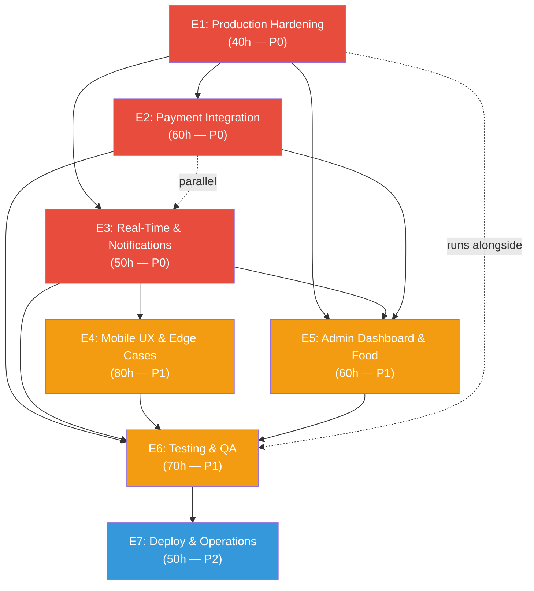

# EasyRyde — Dependency Map

**Phase:** 04 — Work Breakdown
**Version:** 1.0.0
**Updated:** 2026-06-17

---

## Dependency Rules

| Rule | Description |
|------|-------------|
| **R1** | E1 (Production Hardening) must complete before E2 (Payments) — secure foundation first |
| **R2** | E2 (Payments) must complete before launch — critical path, cannot ship without money flow |
| **R3** | E3 (Real-Time & Notifications) can run parallel with E2 — independent workstreams |
| **R4** | E4 (Mobile UX & Edge Cases) depends on E3 for push notifications, GPS tracking, and SOS |
| **R5** | E5 (Admin Dashboard & Food) can start after E1, runs parallel with E2/E3 |
| **R6** | E6 (Testing & QA) runs alongside all epics, intensifies after E2/E3/E4 complete |
| **R7** | E7 (Deploy & Operations) is the final epic — depends on all others being code-complete |

---

## Story-Level Dependencies

### E1: Production Hardening — No upstream dependencies (root epic)

| Story | Depends On | Blocks |
|-------|-----------|--------|
| E1.1 FormRequests | — | E2, E5 (all need validated endpoints) |
| E1.2 .gitignore & secrets | — | E7 (can't deploy with secrets in repo) |
| E1.3 .env.example | — | E2, E7 (gateway configs) |
| E1.4 Rate limiting | — | E7 (security requirement) |
| E1.5 PII encryption | — | E7 (POPIA requirement) |
| E1.6 Sentry monitoring | — | E7 (monitoring required for go-live) |

### E2: Payment Integration — Depends on E1

| Story | Depends On | Blocks |
|-------|-----------|--------|
| E2.1 Stripe | E1.1, E1.3 | E2.4 (escrow), E2.6 (refunds), E2.7 (payouts) |
| E2.2 PayFast | E1.1, E1.3 | E2.4, E2.6 |
| E2.3 Ozow | E1.1, E1.3 | E2.4, E2.6 |
| E2.4 Escrow | E2.1, E2.2, E2.3 | — |
| E2.5 Cash reconciliation | E1.1 | E5.7 (payout panel) |
| E2.6 Refund workflow | E2.1, E2.2, E2.3 | — |
| E2.7 Payout engine | E2.1, E2.2, E2.3, E2.5 | E5.7 (payout panel) |

### E3: Real-Time & Notifications — Depends on E1 only

| Story | Depends On | Blocks |
|-------|-----------|--------|
| E3.1 FCM push | E1.1, E1.3 | E3.5 (notification center), E3.6 (SOS), E4 (mobile pushes) |
| E3.2 GPS tracking | — | E3.5, E4.3 (animated markers) |
| E3.3 SMS | E1.3 | E3.6 (SOS SMS) |
| E3.4 Email | E1.3 | E3.6 (SOS email) |
| E3.5 Notification center | E3.1 | E4.5 (pull-to-refresh includes notifications) |
| E3.6 SOS system | E3.1, E3.3, E3.4 | E5.1 (admin SOS dashboard) |

### E4: Mobile UX & Edge Cases — Depends on E3 (notifications, GPS, SOS)

| Story | Depends On | Blocks |
|-------|-----------|--------|
| E4.1 Offline mode | — | — |
| E4.2 Route polylines | — | — |
| E4.3 Animated driver marker | E3.2 | E4.2 (can combine) |
| E4.4 Deep linking | — | E3.5 (notification deep links) |
| E4.5 Pull-to-refresh | E3.5 | — |
| E4.6 Form validation | — | — |
| E4.7 Loading/error/empty | — | — |
| E4.8 Scheduled rides | E3.1 (notifications) | — |
| E4.9 Earnings charts | — | — |
| E4.10 Biometrics | — | — |

### E5: Admin Dashboard & Food — Depends on E1, runs parallel with E2/E3

| Story | Depends On | Blocks |
|-------|-----------|--------|
| E5.1 Live dashboard | E3.6 (SOS WS events) | — |
| E5.2 Driver documents | — | — |
| E5.3 Pricing editor | E1.1 (FormRequest for save) | — |
| E5.4 Restaurant CRUD | — | E5.5 |
| E5.5 Food order dispatch | E5.4, E3.1 (push to driver), E3.2 (GPS) | — |
| E5.6 Audit log viewer | — | — |
| E5.7 Payout panel | E2.7 | — |

### E6: Testing & QA — Runs alongside all epics

| Story | Depends On | Blocks |
|-------|-----------|--------|
| E6.1 Unit tests | Relevant service code | E7 (quality gate) |
| E6.2 Integration tests | Completed API endpoints | E7 (quality gate) |
| E6.3 Admin E2E (Playwright) | E5 completed | E7 (quality gate) |
| E6.4 Mobile E2E (Detox) | E4 completed | E7 (quality gate) |
| E6.5 Load tests (k6) | E7.1 (Docker staging) | E7 (performance gate) |
| E6.6 Security tests | E1.4 (rate limiting exists) | E7 (security gate) |

### E7: Deploy & Operations — Depends on all epics code-complete

| Story | Depends On | Blocks |
|-------|-----------|--------|
| E7.1 Docker production | — | E7.2, E7.4 |
| E7.2 Monitoring | E1.6 (Sentry config) | — |
| E7.3 Database backup | — | Launch |
| E7.4 CI/CD pipeline | E7.1 | Launch |
| E7.5 Zero-downtime deploy | E7.1, E7.4 | Launch |

---

## Dependency Graph

```
                      +-----------------------+
                      |    E1: Hardening      |
                      |  (FormRequests, .env,  |
                      |   rate-limit, Sentry)  |
                      +-----------+-----------+
                                  |
            +---------------------+-----------------------+
            |                                             |
            v                                             v
+-----------+-----------+                     +-----------+-----------+
|    E2: Payments       |                     |   E3: Real-Time      |
|  (Stripe, PayFast,    |     PARALLEL        |  (FCM, GPS, SMS,     |
|   Ozow, Escrow,       | <-----------------> |   Email, SOS)        |
|   Refunds, Payouts)   |                     |                      |
+-----------+-----------+                     +-----------+-----------+
            |                                             |
            |                                             |
            |                                     +-------v-------+
            |                                     |  E4: Mobile   |
            |                                     | (UX, offline, |
            |                                     |  maps, deep-  |
            |                                     |  links, etc.) |
            |                                     +-------v-------+
            |                                             |
            +---------------------+                       |
                                  |                       |
                        +---------v-----------+           |
                        |   E5: Admin & Food  |           |
                        | (Dashboard, Pricing,|           |
                        |  Restaurants, Food) |           |
                        +---------+-----------+           |
                                  |                       |
                                  +-------+-------+-------+
                                          |       |
                                          v       v
                          +-------------------+--------+--------+
                          |        E6: Testing & QA             |
                          |  (Unit, Integration, E2E, Load,     |
                          |   Security — runs alongside all,    |
                          |   intensifies after E2-E5)          |
                          +-------------------+--------+--------+
                                                |
                                                v
                          +-------------------+--------+--------+
                          |        E7: Deploy & Operations      |
                          |  (Docker, Monitoring, Backup,       |
                          |   CI/CD, Zero-downtime)             |
                          +-------------------------------------+
```

### Mermaid Diagram



---

## Critical Path

The **critical path** (longest chain of dependent tasks) is:

```
E1 (40h) → E2 (60h) → E5 (60h) → E6 (70h) → E7 (50h) = 280 hours
```

E3 (50h) and E4 (80h) run in parallel but E4 depends on E3 internally:
```
E3 (50h) → E4 (80h) = 130h parallel branch
```

**Total calendar estimate with 2 parallel tracks (backend + mobile):**
- Track A (backend): E1 → E2 → E5 → E6 → E7 = ~18 weeks with 1 full-time backend dev
- Track B (mobile): E3 → E4 = ~12 weeks with 2 mobile devs (can merge into Track A after E2)

With full parallel execution (3 tracks), estimated calendar time: **~10 weeks**.

---

## Parallel Execution Strategy

| Week | Track A (Backend) | Track B (Mobile) | Track C (Infra/QA) |
|------|-------------------|------------------|-------------------|
| W1   | E1 (Hardening)    | —                | E6 (test planning) |
| W2   | E2 (Payments)     | E3 (Real-Time)   | E6 (unit tests) |
| W3   | E2 (Payments)     | E3 (Real-Time)   | E6 (integration) |
| W4   | E5 (Admin/Food)   | E4 (Mobile UX)   | E6 (integration) |
| W5   | E5 (Admin/Food)   | E4 (Mobile UX)   | E6 (E2E) |
| W6   | E5 (Admin/Food)   | E4 (Mobile UX)   | E6 (E2E + load) |
| W7   | E5 (Admin/Food)   | E4 (Mobile UX)   | E6 (security) |
| W8   | E5 (Admin/Food)   | E4 (Mobile UX)   | E6 (final) |
| W9   | E7 (Deploy)       | E7 (Deploy)      | E7 (Deploy) |
| W10  | E7 (Deploy)       | E7 (Deploy)      | E7 (Deploy) |

---

*End of dependency-map.md*
