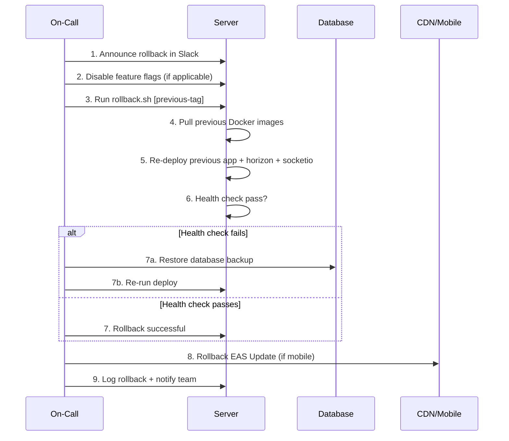

# Rollback Strategy

**Phase:** 07 — Release Plan  
**Document:** Rollback Strategy  
**Version:** 1.0.0  
**Date:** 2026-06-17  
**Status:** Draft

---

## 1. Rollback Principles

| Principle | Description |
|-----------|-------------|
| **Backup-first** | Take a full database snapshot before every deployment |
| **Feature flags first** | Prefer disabling a feature via flag over full rollback |
| **Forward fix preferred** | Only rollback if forward fix takes longer than rollback + re-deploy |
| **Deploy freeze** | No deployments after Friday 2PM. Emergency hotfix path only. |
| **Communication** | All rollbacks announced in Slack #ops immediately |

---

## 2. Rollback Decision Matrix

| Scenario | Rollback? | Action |
|----------|-----------|--------|
| Health check fails | Yes | Auto-rollback via CI |
| Error rate spikes > 1% | Evaluate | If new deployment → rollback. If old code → fix forward. |
| Database migration breaks | Yes | Rollback migration + restore backup |
| Payment processing fails | Yes | Immediate rollback |
| Performance regression > 2× baseline | Evaluate | If > 10min → rollback. If < 10min → fix forward. |
| Security vulnerability found | Yes | Immediate rollback + patch |
| Minor visual bug | No | Fix forward in next release |
| Feature doesn't work as expected | No | Feature flag off, fix forward |

---

## 3. Application Rollback

### 3.1 Docker Image Rollback

Rollback to a specific previous Docker image tag:

```bash
# On production server
cd /var/www/easyryde

# Find previous stable image tag
docker images ghcr.io/easyryde/app
# Output: ghcr.io/easyryde/app  v2026.06.16.1   abc123def

# Set previous tag in docker-compose.override.yml or .env
export APP_IMAGE_TAG=v2026.06.16.1

# Re-deploy with previous image
docker compose up -d --no-deps --force-recreate app horizon

# Verify health
./deploy/scripts/health-check.sh

# If Socket.io also needs rollback
export SOCKETIO_IMAGE_TAG=v2026.06.16.1
docker compose up -d --no-deps --force-recreate socketio
```

### 3.2 Automated Rollback Script

Script at `deploy/scripts/rollback.sh`:

```bash
#!/bin/bash
# rollback.sh — Rollback to previous Docker image tag
# Usage: ./rollback.sh [tag]  (defaults to previous tag from deploy log)

set -euo pipefail

TAG="${1:-$(tail -1 /var/log/easyryde/deploy.log | awk '{print $2}')}"
echo "[$(date)] Rolling back to tag: $TAG"

export APP_IMAGE_TAG=$TAG
export SOCKETIO_IMAGE_TAG=$TAG

docker compose pull
docker compose up -d --no-deps --force-recreate app horizon socketio nginx

sleep 10

if ./deploy/scripts/health-check.sh; then
  echo "[$(date)] Rollback to $TAG successful"
  echo "ROLLBACK $TAG $(date)" >> /var/log/easyryde/rollback.log
else
  echo "[$(date)] Rollback FAILED. Manual intervention required."
  echo "ROLLBACK_FAILED $TAG $(date)" >> /var/log/easyryde/rollback.log
  exit 1
fi
```

---

## 4. Database Rollback

### 4.1 Migration Rollback

If the deployment includes a new database migration that needs to be reverted:

```bash
# Rollback the last batch of migrations
php artisan migrate:rollback --step=1

# If multiple migrations were deployed:
php artisan migrate:rollback --step=5  # rollback 5 batches
```

### 4.2 Data Migration Rollback

For destructive data migrations (column drops, data transformations):

```bash
# 1. Restore pre-deployment database backup first
pg_restore -d easyryde /backups/easyryde_2026-06-17_120000.dump

# 2. Then re-run all migrations except the one being rolled back
# (migrations table will have the rolled-back migration removed)
```

### 4.3 Backup Verification Before Deploy

Before every deployment that includes a migration, run:

```bash
# Create backup
pg_dump -Fc -d easyryde > /backups/easyryde_$(date +%Y-%m-%d_%H%M%S).dump

# Verify backup integrity
pg_restore -l /backups/easyryde_*.dump > /dev/null && echo "Backup valid"
```

### 4.4 Backup Retention

| Backup Type | Retention | Location |
|-------------|-----------|----------|
| Pre-deploy snapshot | 30 days | Local disk + S3 |
| Daily full backup | 30 days | S3 bucket |
| Hourly WAL archive | 7 days | S3 bucket |
| Weekly full backup | 6 months | S3 Glacier |

---

## 5. Frontend Rollback

### 5.1 Mobile App (React Native / Expo)

| Scenario | Rollback Method | Time |
|----------|----------------|------|
| JS bundle bug | Expo CodePush (EAS Update) rollback | 5 minutes |
| Native code bug | App store re-submission + forced upgrade | 1-7 days |
| API incompatibility | Feature flag + API version backward compat | Immediate |

**EAS Update Rollback:**

```bash
# List EAS Update groups
eas update:list --branch production

# Rollback to previous update
eas channel:rollback --branch production --channel production
```

### 5.2 Web Admin Dashboard

| Scenario | Rollback Method | Time |
|----------|----------------|------|
| JS bundle bug | Deploy previous build artifact | 5 minutes |
| API incompatibility | Keep old API version running | Immediate |

---

## 6. Feature Flags

### 6.1 Flag Inventory

All new features must be behind a feature flag for the first release cycle:

| Flag | Description | Default | Toggle Method |
|------|-------------|---------|---------------|
| `feature.food_delivery` | Enable food delivery module | Off | Config + env |
| `feature.surge_pricing` | Enable dynamic surge pricing | Off | Config + env |
| `feature.referrals` | Enable referral bonus program | Off | Config + env |
| `feature.premium_categories` | Enable premium/XL ride types | On | Config + env |
| `feature.scheduled_rides` | Enable ride scheduling | On | Config + env |
| `feature.promo_codes` | Enable promo code redemption | On | Config + env |

### 6.2 Toggling a Feature Flag

```bash
# Disable food delivery immediately (no deploy needed)
php artisan feature:disable food_delivery

# Verify
php artisan feature:status food_delivery
# > food_delivery: DISABLED
```

### 6.3 Feature Flag Implementation

Feature flags read from `config/features.php`:

```php
<?php
// config/features.php
return [
    'food_delivery' => env('FEATURE_FOOD_DELIVERY', false),
    'surge_pricing' => env('FEATURE_SURGE_PRICING', false),
    'referrals' => env('FEATURE_REFERRALS', false),
    'premium_categories' => env('FEATURE_PREMIUM_CATEGORIES', true),
    'scheduled_rides' => env('FEATURE_SCHEDULED_RIDES', true),
    'promo_codes' => env('FEATURE_PROMO_CODES', true),
];
```

Usage in code:

```php
if (config('features.food_delivery')) {
    // Food delivery routes, controllers, etc.
}
```

---

## 7. Rollback Sequence (Step-by-Step)

### 7.1 Full Rollback (All Components)



### 7.2 Timeline Targets

| Step | Target Duration |
|------|-----------------|
| Detect issue | < 1 min (health check or alert) |
| Decide to rollback | < 2 min |
| Execute rollback script | < 3 min |
| Health verification | < 1 min |
| **Total downtime** | **< 7 min** |

---

## 8. Communication Templates

### 8.1 Rollback Initiated

```
🚨 ROLLBACK INITIATED
Deploy: v2026.06.17.2 → v2026.06.16.1
Reason: [brief description of issue]
Time: 12:05 UTC
Engineer: @oncall
Estimated completion: 12:12 UTC
```

### 8.2 Rollback Complete

```
✅ ROLLBACK COMPLETE
Deploy: v2026.06.17.2 rolled back to v2026.06.16.1
Duration: 4 minutes
Status: All health checks passing
Next steps: Root cause investigation scheduled
```

### 8.3 Rollback Failed

```
🔴 ROLLBACK FAILED — MANUAL INTERVENTION REQUIRED
Previous tag: v2026.06.16.1
Rollback attempted: 12:05 UTC
Failed: 12:10 UTC
Current state: Health check failing after rollback
Action: @lead escalate immediately
```

---

## 9. Post-Rollback Activities

| Activity | Owner | Timeline |
|----------|-------|----------|
| Root cause analysis | Lead engineer | Within 4 hours |
| Fix the issue | Assigned developer | Within 24 hours |
| Add regression test | QA lead | Within 24 hours |
| Deploy fix | Release engineer | After approval |
| Update runbook | Lead engineer | Within 1 week |
| Retrospective | Whole team | Within 2 weeks |

---

## 10. Deploy Freeze Policy

| When | Restriction | Exception |
|------|-------------|-----------|
| Friday after 2PM | No production deploys | Security vulnerability or payment outage |
| Public holidays | No production deploys | Pre-approved by CTO |
| Peak hours (8-10AM, 4-6PM) | No production deploys | Emergency hotfix only |
| During load testing | No production deploys | — |

### Emergency Hotfix Path

If a deploy is needed during freeze:

1. Lead engineer approves the exception in writing (Slack)
2. Deploy is fully staffed (2 engineers minimum)
3. Rollback plan is prepared before deploy
4. Post-deploy monitored for 30 minutes
5. Post-mortem required within 24 hours
